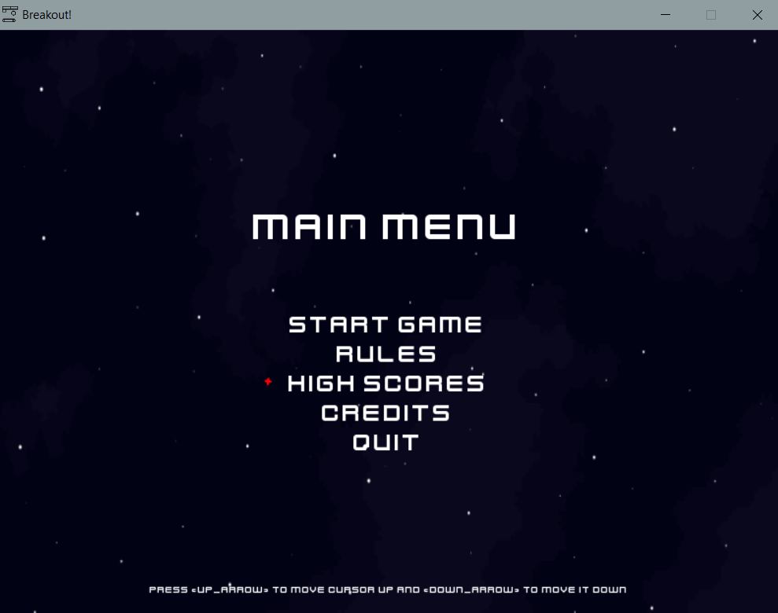
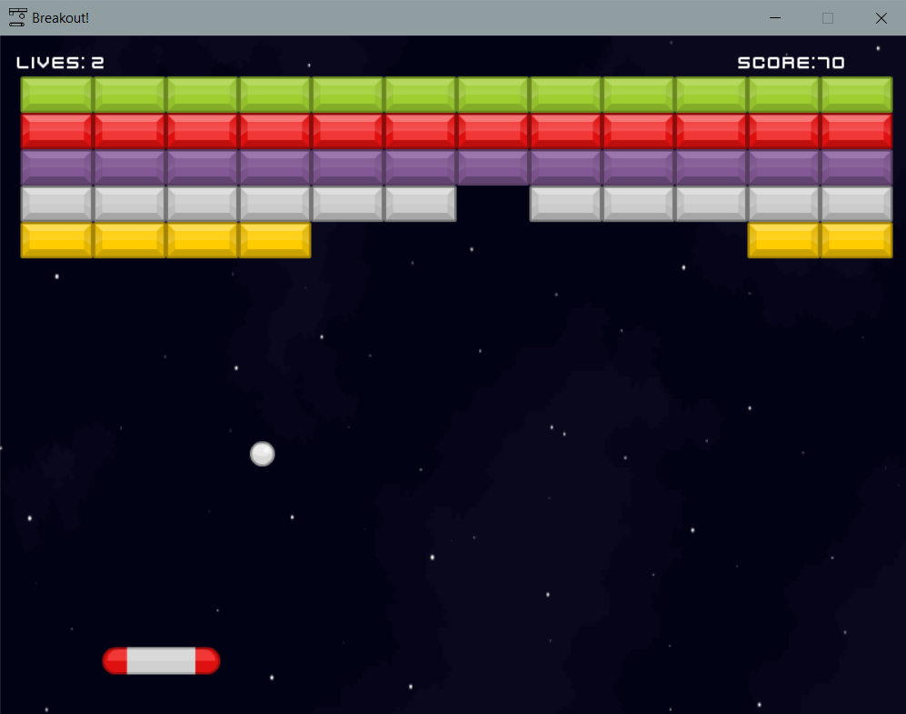
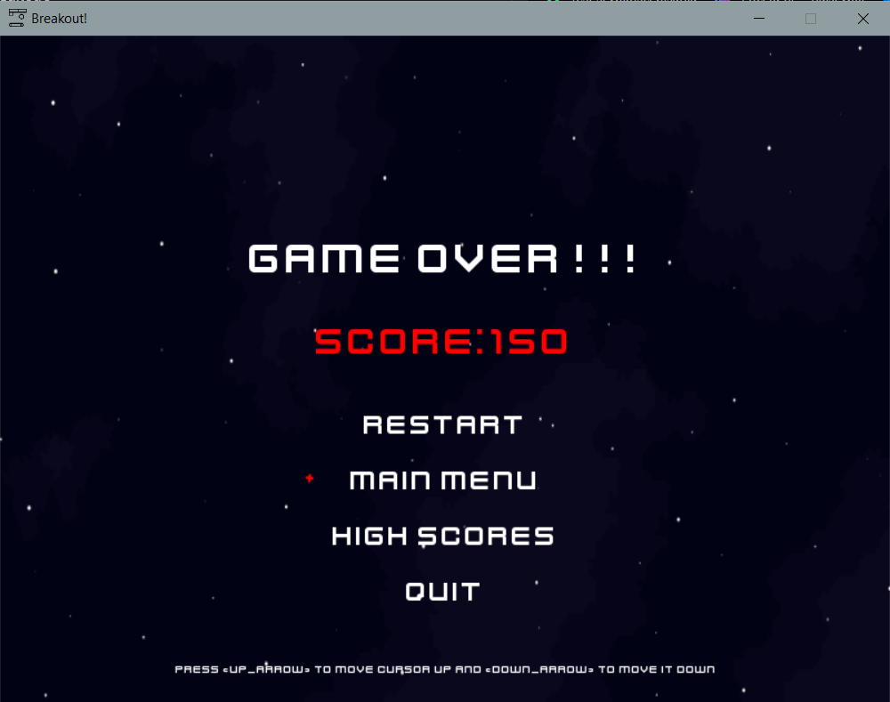

# Breakout
## Author: Magdalena Szymkowiak

### Short description
This project was created within the programming course at the Wrocław University of Science and Technology.
This game is a clone of well-known arcade game named Arkanoid, also called as Breakout. The main aim of this game is breaking all of the bricks and getting the highest score. 

### Technologies
**Python** - programming language, verison 3.7.9 recommended. 

**Pygame** - library for writing arcade games.

### How to run this app?
1. Clone the project, to your directory: 
`git clone  https://github.com/maggszy/game.git breakout_game`
`cd breakout_game `
2. Install the project's development and runtime requirements:
`pip install -r requirements.txt`
3. Run the game:
`python maingame.py`
4. Have fun :video_game: :smile:.